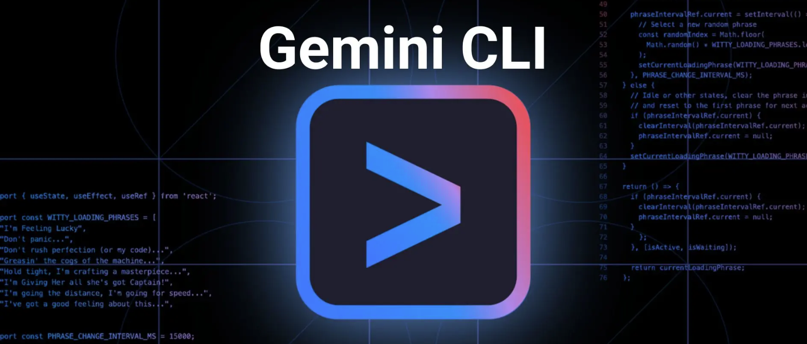
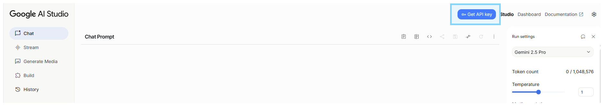
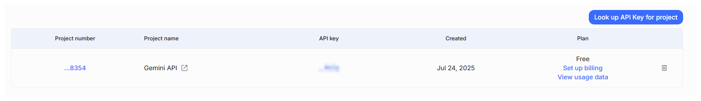

# Setup Guide
- **Set workspace/project path** for Gemini to work on
  - Set `GEMINI_WORKSPACE_DIR=<YOUR PROJECT PATH>` in **~/.bash_profile**
  
- **Get Gemini API key**
  - Access to https://aistudio.google.com/ to create key




- Copy `.env.example` to `.env` and fill up env below.
  - For **general** or **coding** use:
    - `GEMINI_API_KEY`
    - `GIT_EMAIL`
    - `GIT_USERNAME`
  - For **database** use:
    - `DB1_ENDPOINT`
    - `DB1_PORT`
    - `DB1_USER`
    - `DB1_PASS`
    - `DB1_DATABASE_NAME`

- **Create Docker network**
  - `docker network create global-net`
- **Add Docker network to any Datbase docker-compose.yml configuration**
  ```yaml 
  services:
    DB_Container:
        # --- add below ---
        networks:
          global-net:

        networks:
          global-net:
            external: true
  ```

- **Start up**
  - `docker compose up -d`
  - `docker exec -it gemini_cli bash` *** **Notes:** May take some times to load up CLI


  - **Check available MCP tools** via `/mcp` command

